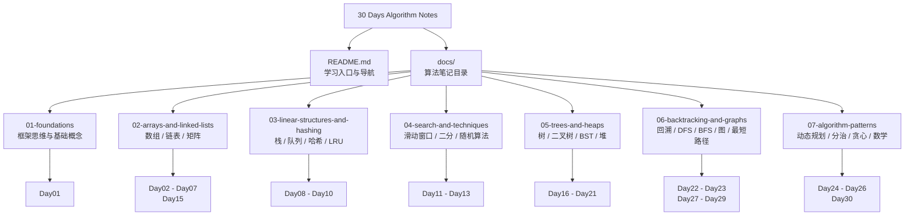

# 30 Days Algorithm Notes

一份慢慢长大的算法学习笔记。这里记录了 30 天算法主题里的核心概念、模板、例题和一点点学习时的碎碎念。

愿它像一张小地图：迷路的时候能帮你找回方向，刷题的时候也能提醒你“这题其实见过”。

## 小地图

```text
docs/
├── 01-foundations/                    # 框架思维与基础概念
├── 02-arrays-and-linked-lists/         # 数组、链表、矩阵与链表技巧
├── 03-linear-structures-and-hashing/   # 栈、队列、哈希表、LRU
├── 04-search-and-techniques/           # 滑动窗口、二分、随机算法
├── 05-trees-and-heaps/                 # 树、二叉树、BST、堆
├── 06-backtracking-and-graphs/         # 回溯、DFS、BFS、图、最短路径
└── 07-algorithm-patterns/              # 动态规划、分治、贪心、数学
```

## Mermaid 架构图



## 学习路线

### 01. Foundations

- [Day01 - 数据结构与算法](docs/01-foundations/Day01-数据结构与算法.md)

### 02. Arrays And Linked Lists

- [Day02 - 数组与链表基础](docs/02-arrays-and-linked-lists/Day02-数组与链表基础.md)
- [Day03 - 链表双指针](docs/02-arrays-and-linked-lists/Day03-链表双指针.md)
- [Day04 - 前缀和数组](docs/02-arrays-and-linked-lists/Day04-前缀和数组.md)
- Day05 - 待补一个可爱的小坑位
- [Day06 - 二维数组](docs/02-arrays-and-linked-lists/Day06-二维数组.md)
- [Day07 - 环形数组](docs/02-arrays-and-linked-lists/Day07-环形数组.md)
- [Day15 - 反转单链表](docs/02-arrays-and-linked-lists/Day15-反转单链表.md)

### 03. Linear Structures And Hashing

- [Day08 - 队列与栈](docs/03-linear-structures-and-hashing/Day08-队列与栈.md)
- [Day09 - 哈希表](docs/03-linear-structures-and-hashing/Day09-哈希表.md)
- [Day10 - 手写 LRU](docs/03-linear-structures-and-hashing/Day10-手写LRU.md)

### 04. Search And Techniques

- [Day11 - 滑动窗口](docs/04-search-and-techniques/Day11-滑动窗口.md)
- [Day12 - 二分查找](docs/04-search-and-techniques/Day12-二分查找.md)
- [Day13 - 游戏中的随机算法](docs/04-search-and-techniques/Day13-游戏中的随机算法.md)
- Day14 - 待补一个小小中转站

### 05. Trees And Heaps

- [Day16 - 二叉树遍历](docs/05-trees-and-heaps/Day16-二叉树遍历.md)
- [Day17 - 二叉树递归遍历](docs/05-trees-and-heaps/Day17-二叉树递归遍历.md)
- [Day18 - 二叉树层序遍历](docs/05-trees-and-heaps/Day18-二叉树层序遍历.md)
- [Day19 - 二叉搜索树](docs/05-trees-and-heaps/Day19-二叉搜索树.md)
- [Day20 - 二叉堆](docs/05-trees-and-heaps/Day20-二叉堆.md)
- [Day21 - 树](docs/05-trees-and-heaps/Day21-树.md)

### 06. Backtracking And Graphs

- [Day22 - 回溯](docs/06-backtracking-and-graphs/Day22-回溯.md)
- [Day23 - DFS 深度优先](docs/06-backtracking-and-graphs/Day23-DFS深度优先.md)
- [Day27 - BFS](docs/06-backtracking-and-graphs/Day27-BFS.md)
- [Day28 - 图](docs/06-backtracking-and-graphs/Day28-图.md)
- [Day29 - 最短路径](docs/06-backtracking-and-graphs/Day29-最短路径.md)

### 07. Algorithm Patterns

- [Day24 - 动态规划](docs/07-algorithm-patterns/Day24-动态规划.md)
- [Day25 - 分治](docs/07-algorithm-patterns/Day25-分治.md)
- [Day26 - 贪心](docs/07-algorithm-patterns/Day26-贪心.md)
- [Day30 - 数学算法](docs/07-algorithm-patterns/Day30-数学算法.md)

## 使用方式

可以按 Day 顺序从头读，也可以按专题跳着查。

建议每篇笔记都这样过一遍：

1. 先看算法思想和模板。
2. 再手写一遍核心代码。
3. 最后挑 1 到 3 道同类题巩固一下。

## 小约定

- 文件名统一为 `DayXX-主题.md`，这样排序会更整齐。
- 所有学习笔记都放在 `docs/` 里，根目录只保留项目说明和配置文件。
- Day05 和 Day14 目前还没有笔记，已经在路线里留好位置啦。

## Keep Going

算法学习不是一口气冲到终点，更像每天给脑袋浇一点水。

今天能多理解一个模板、多想清楚一个边界条件，就已经很不错了。
